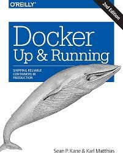
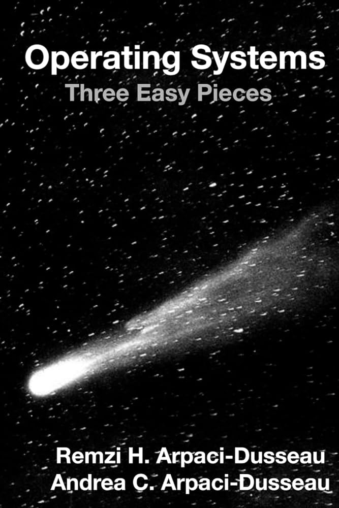

# Docker

Sources (exercices, corrections, démos, etc.) du module d'enseignement Docker.

[Voir la progression pédagogique](./progression.md).

## Références, aller plus loin

- [Open Container Initiative (OCI)](https://opencontainers.org/), gouvernance pour maintenir et garantir des standards ouverts sur les formats de conteneurs et de leurs environnement d'exécution. En font partie Docker Inc., Red Hat, Google, etc.
- [Docker: Up & Running: Shipping Reliable Containers in Production, 3rd edition](https://www.amazon.fr/Docker-Shipping-Reliable-Containers-Production/dp/1098131827/ref=pd_sbs_d_sccl_3_2/261-8003303-3459731), de Sean P Kane (Auteur), Karl Matthias (Auteur), publié chez O'Reilly, 2023. La deuxième édition (bien que quelques exemples/dépôts cassés et quelques éléments datés) est très bien également. La progression de ce cours est en grande partie basée sur la progression de cet ouvrage.
- [Docker: A Project-Based Approach to Learning](https://www.amazon.fr/Docker-Project-Based-Approach-Jason-Cannon/dp/B09GCSHXL7/ref=sr_1_13), de Jason Cannon, auto-publié, 2021 
- [Docker Deep Dive: Zero to Docker in a single book (Mastering Containers 1) (English Edition)](), auto édité, de Nigel Poulton, 2016. Je n'ai pas (encore) parcouru ou utilisé ce livre. Reviews encourageantes. À voir...
- [Operating Systems, three easy pieces](https://pages.cs.wisc.edu/~remzi/OSTEP/), ou le *Comet OS Book*, de Remzi H. Arpaci-Dusseau and Andrea C. Arpaci-Dusseau (University of Wisconsin-Madison), publié par l'université du Wisconsin, 2008, continuellement mis à jour. Accessible en ligne. *Une référence* sur les systèmes d'exploitation. Voir le chapitre sur la virtualisation.